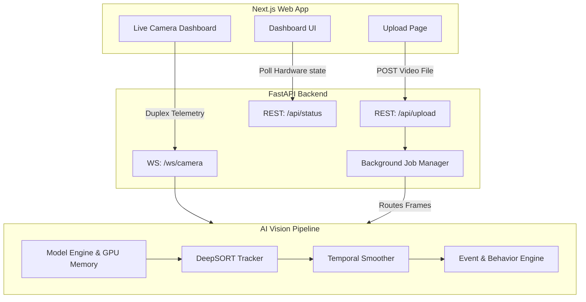
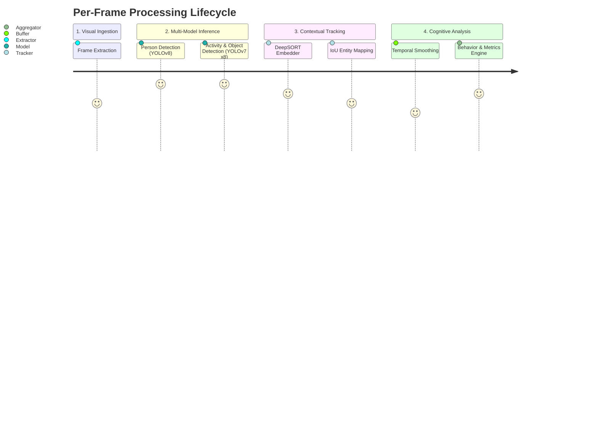
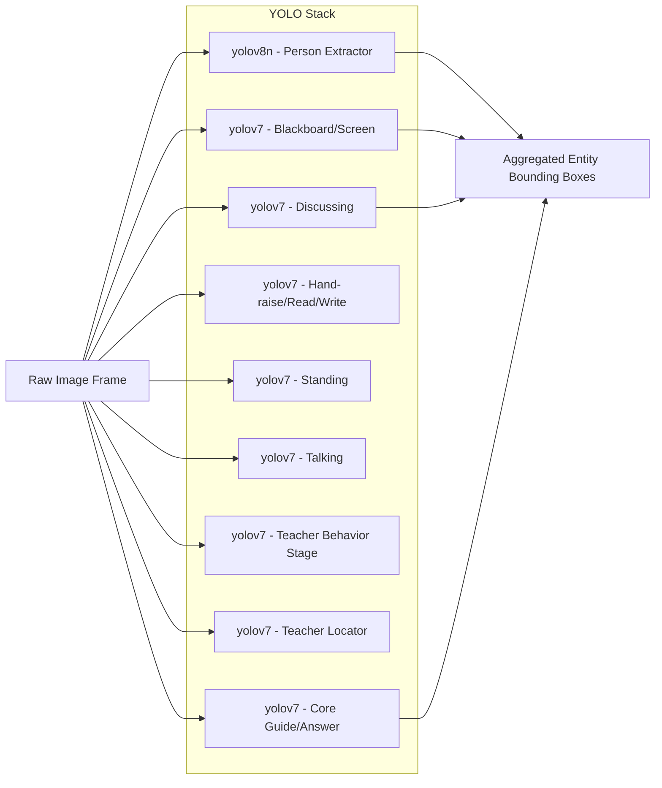
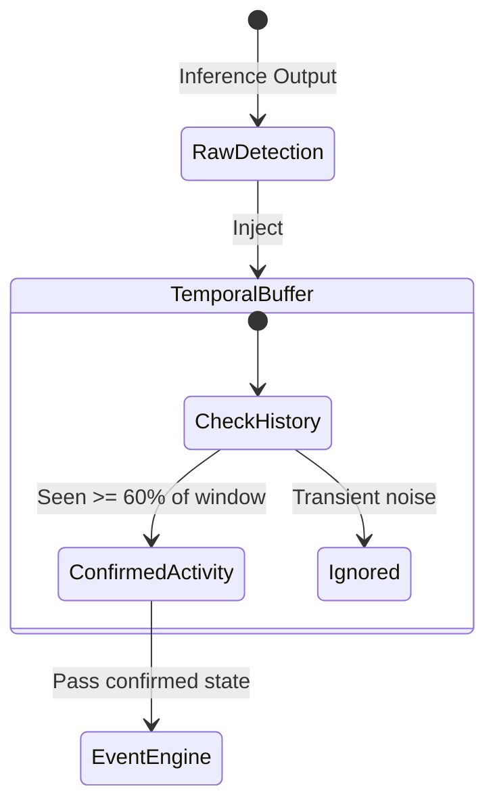
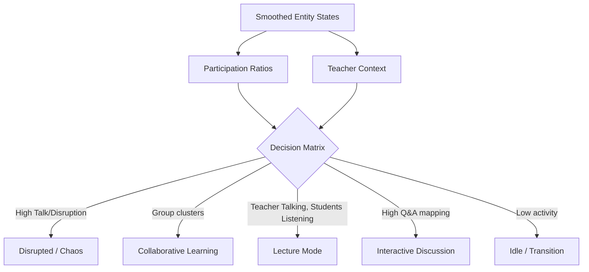

<div align="center">
  <h1>Neural Nexus</h1>
  <p><b>AI-Powered Classroom Intelligence System</b></p>
  <p><i>Real-time Behavioral Analysis, Engagement Tracking, and Live Camera Streaming Powered by 9 GPU-Accelerated YOLO Models & DeepSORT</i></p>
</div>

---

## Overview

**Neural Nexus** is a production-grade inference system designed to monitor and analyze physical classroom environments. By utilizing a robust sequential computer vision pipeline, it transforms raw classroom video or live webcam feeds into structured, actionable intelligence including student engagement scores, disruptive event tracking, and overall classroom state assessment.

Built on **FastAPI (Backend)** and **Next.js (Frontend UI)**, Neural Nexus delivers real-time analytics to a web interface featuring a modern, NexArch-inspired aesthetic. 

---

## System Architecture

The overarching system leverages a decoupled architecture. The frontend handles interactive file drops, status polling, and live video renders, while the FastAPI backend handles REST routing, WebSocket streaming, and asynchronous AI model processing.



---

## The AI Vision Pipeline

The core component of Neural Nexus is the modular AI pipeline, meticulously developed to resolve flickering detections and unstable tracking. The pipeline runs sequentially across every processed frame.



### 1. Multi-Model Inference
Because classroom environments contain vast diversity, learning specific micro-activities requires multiple fine-tuned models rather than one monolithic network. We cache all 9 models into GPU VRAM (`cuda:0`) on server startup to bypass the 15-second cold-start latency. 



### 2. Entity Tracking (DeepSORT)
To measure behavior over time, the system uses **DeepSORT (Simple Online and Realtime Tracking with a Deep Association Metric)**. Bounding boxes are filtered, matched with historical tracks using an IoU metric, and re-identified via a CNN Embedder (MobileNetV2 running on CPU to save critical GPU VRAM). 

### 3. Temporal Smoothing
Raw frame detections often "flicker" (e.g., a student raising their hand triggers detection on frame 14, drops on frame 15, and resumes on frame 16). The `TemporalSmoother` maintains a rolling memory window (e.g., 30 frames) to require continuous consensus before solidifying an activity as "confirmed".



### 4. Event & Behavior Engine
Once activities are stabilized, the `EventEngine` infers the overall classroom state by analyzing ratios. If the system detects `Teacher_Guide` + `Talking` + `Interaction`, it registers "Active Engagement".



---

## Telemetry Protocol (WebSocket) 

For live camera mode, ensuring latency remains under 400ms is paramount. Neural Nexus pushes a serialized pipeline state back to the browser.
The Frontend natively overlays metrics utilizing `CSS Grid` and React Hooks, ensuring no visible tearing.

**WebSocket Payload Spec:**
```json
{
  "type": "frame",
  "frame": "base64_encoded_jpeg...",
  "metrics": {
    "engagement_score": 0.84,
    "participation_rate": 0.65,
    "disruption_index": 0.05,
    "teacher_interaction_ratio": 0.72
  },
  "classroom_state": "LECTURE_MODE",
  "state_confidence": 0.88,
  "inference_ms": 112.4
}
```

---

## Environment Configuration & Deployment

### Hardware Requirements
- **OS**: Windows / Linux
- **GPU**: NVIDIA GPU with minimum 4GB VRAM (GTX 1650 or higher). *The system actively allocates ~1.5GB merely to cache all 9 uncompressed models.*
- **RAM**: 16 GB System Memory

### Running Locally

Neural Nexus separates the AI backend (FastAPI) and UI frontend (Next.js).

**1. Start the API Server & Pipeline**
```bash
cd backend
pip install -r ../requirements.txt 
python server.py
```

**2. Start the Frontend Application**
```bash
cd frontend
npm install
npm run dev
```
